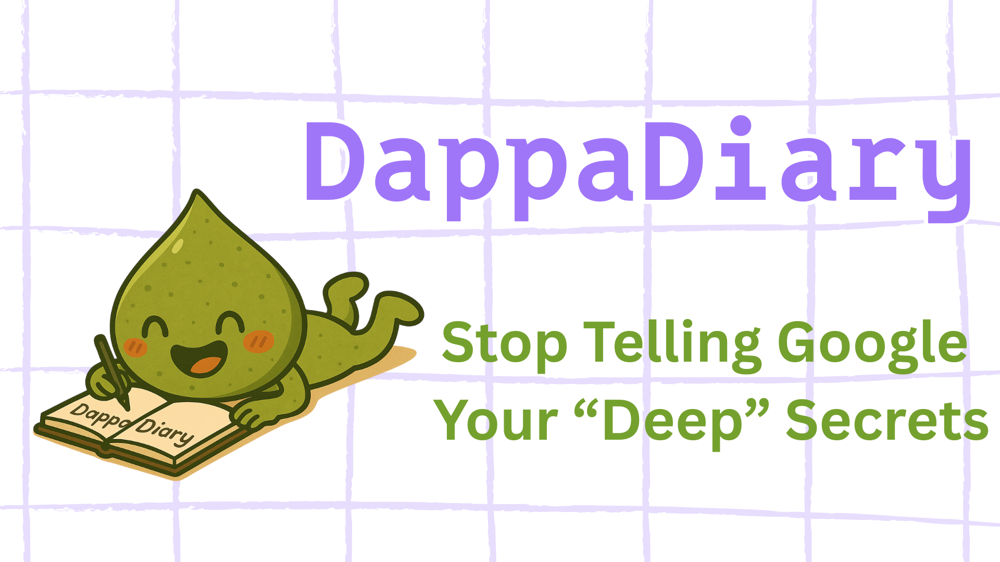
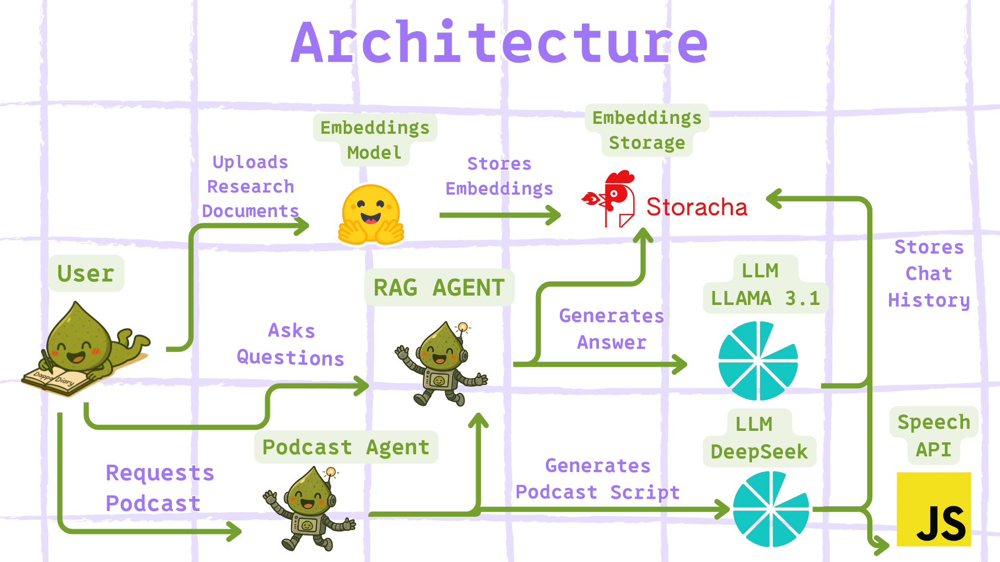

# DappaDiary - Your Own Notebook LM

 ## Description 

Fileverse brought a Google Docs like expereince onchain. But why should we stop there? 

DappaDiary is your own onchain Notebook LM. So you can share do deep research without sharing it with Google. It usese the power of decentralized AI and storage to keep the research private and secure. This enables users to have a private research assistant that is not subject to the ownership of a single company. 

If you are unfamiliar with [Notebook LM](https://notebooklm.google/) - it as an LLM powered notebook that allows users to upload docuements and ask questions about them. 

For this hackathon, I tried to capture two key features of the Notebook LM and used 2 AI Agents to power the features:

- Research Assistant - via RAG - User uploads documents and can then use those documents for research by  interacting with the RAG Agent. 
- Podcast Generation - Based on the uploaded documents, the system will generate a podcast script and audio based on the uploaded documents. This should cover key points and be delivered in podcast format.  

## How I built it - Tech Stack 

### Sponsor Technologies 
**Lilypad** - I used the Lilypad Inference API for two AI Agents in this project:

 1) RAG Agent that uses the Llama3.1 Model to power the chat feature for the user.  This agent is also resposible for retereving the relevant chunks that are strored in the Storacha vector database.  This powers the research assistant feature by giving answers in the context of the uploaded documents rather than a generic response based on the LLM's training data.  

2) Podcast Agent - This agent is responsible for generating the podcast script and audio based on the uploaded documents.  It usese the Deepseek LLM on Lilypad to generate the script. This is done by collborating with the RAG Agent  by asking it questions and then using those answers to genreate an engaing podcast script. The advantage of using Deepseek is the generate more thoughtful questions rather than a generic script. 

**Storacha** - I used Storacha to store and retrieve the vector embeddings of the uploaded documents as well as the chat history for later retrieval.  The RAG Agent creates the embeddings via a local Hugging Face Embeddings Model and then create the chunks and store them in the Storacha vector database. It then also creates a CID map of the chunks relevant to the specific document. Once a users asks a question, it starts the RAG Agent to retrieve the most relevant chunks from the Storacha and hands it over to the LLM to generate an in context response. 

If a user requests a podcast, the Podcast Agent is started and it uses the RAG Agent to retrieve the most relevant chunks from the Storacha vector database. It then uses the Deepseek LLM to generate a podcast script. The two AI Agents collaborate to retrieve the most relevant chunks from the Storacha vector database to power the podcast generation. 

 After a conversation  is complete, the chat history is stored on Storacha as well via the Podcast and RAG Agents. This enables cached discussions and mainitaing context for the podcast generation as as future converstations. 

### Non-Sponsor Technologies 
**Next JS** - I used NextJS for the frontend and chat intereface. This enabled browser based upload of documents and server side processing of the documents. 

**Hugging Face** - I used the Hugging Face Embeddings Model to create the vector embeddings of the uploaded documents. The model is run on the host machine so it doesn not send anything via an API to OpenAI. 

**LangGraph.js** - For Agent coordination that is used for RAG and Podcast genreation workflows. 

**Synthetic Voice API** - I used the Synthetic Voice API to generate the audio for the podcast.  This is used to generate the audio for the podcast script. 

## Next Steps 
**Better Podcast Audio** -  Although I tried using a local model that could run client side like Kokoro - I was not able to get it to work. I would like to use this model to generate the audio for the podcast for more natural sounding audio like Notebook LM. 

**Youtube Upload** - Another feature I would like to add is the ability for a user to add a Youtube video URL and then allow the RAG Agent to answer questions about the video as well. 
